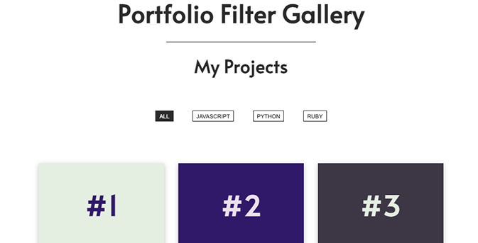

# Portfolio Filter Gallery
In the Portfolio Filter Gallery, users click on filter buttons to see select web projects. The filters represent coding languages used in the projects. Built with vanilla JavaScript, HTML5, CSS3, and Flexbox.

## About
The Portfolio Filter Gallery showcases web projects. The gallery is filterable so users can select the type of projects they want to see by clicking on buttons representing coding languages used in the projects. The filter will show only the projects built with the language selected by the user. 

Users can filter the portfolio gallery by: 

- **All** - shows all projects
- **JavaScript** - incl. libraries and frameworks  
- **Python** - incl. libraries and frameworks
- **Ruby** - incl. libraries and frameworks

## Project Background
This was a personal project I designed and built from scratch with vanilla JavaScript. With the Portfolio Filter Gallery, I set out to practice my analytical skills by breaking down an idea into components, understanding what each component should do, and how the data will need to flow between the components to create the desired functionality. 

My goal was to create a dynamic filtering product that could easily adapt to a changing web project portfolio while limiting the number of places I would need to update the filter code to reflect the changes made. To that end, I enjoyed the challenge of figuring out how to access and process data for the filter buttons without hard-coding too much of the data. This project deepened by understanding of how to work with data stored in an object and allowed me to experiment with strategies for processing that data.

I also gained a better understanding of the Model-View-Controller pattern which I applied to help organize the code and better separate and allocate tasks to the relevant components. 

**Functionality:** 
The Portfolio Gallery Filter is built with scalability in mind. - Each portfolio project contains an HTML data attribute that indicates the main languages used for creating the project. The script uses the HTML data attribute values to automatically create and display the filter buttons. This ensures that the portfolio gallery is dynamic and scalable: The filter automatically adapts to changes in the portfolio and only creates and displays filter buttons for the languages indicated in the portfolio elements' data attributes at any given time. 

When adding languages to or removing languages from the portfolio, only the HTML file needs updating. If new - or existing - projects introduce a new language in the HTML file, a new corresponding button is automatically created and displayed by the script. Conversely, if a language is removed entirely from the portfolio, the script will no longer create and display the corresponding filter button.  

**Design:** 
The code for the filter is based on the Model-View-Controller design pattern: 

- The filter's Model loops through the portfolio projects every time the page (re)loads and every time the user makes a selection. As such, the Model will always reflect the languages represented in the portfolio at any given time. In the loop, the Model collects the HTML data attribute values (i.e. the languages used in the projects), pairs them with their associated portfolio projects, and stores the data as key-value pairs in an object. 

- The View creates and displays the HTML filter buttons that reflect the languages represented in the projects and displays portfolio projects on the front end. The View adds an event listener to each HTML button it renders in the DOM. Later, it applies the appropriate CSS to ensure that only projects that match the user's selection are displayed. When the page (re)loads or when the user clicks a filter button, the View is called by the Controller that passes data - i.e. the languages used in the projects and which projects the user wants to see, respectively - for the View to render. 

- The Controller retrieves and processes data from the Model before passing on the data to the View for display. When a page (re)load is detected by an event listener on the Window, the Controller's event handler calls the Model and retrieves and passes to the View the languages stored in the Model's object. The View uses the language data to create and display the filter buttons. 

The Controller also listens for events triggered by the user clicking the language filter buttons. An event handler retrieves the language label from the button that was clicked, filters through the Model's object to find projects that match the selected language, and hands the data to the View which highlights the selected language button and ensures that only these particular projects are displayed.     

## Built With 
- JavaScript
- HTML5 
- CSS3 
- Flexbox

## Launch
[See the live version of the Portfolio Filter Gallery here.]()

